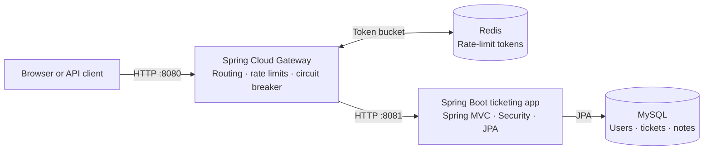

# Helpdesk Pro

A Spring-based help-desk application for submitting, assigning, and tracking support tickets. The repository includes a server-rendered web UI, a versioned JSON API, and a separate Spring Cloud Gateway service with Redis-backed rate limiting and circuit-breaker fallback.

## Architecture



The application and database are private to the Compose network. Only the gateway publishes a host port. Redis stores gateway rate-limit state; MySQL stores users, tickets, and notes. The gateway uses a Resilience4j circuit breaker and a JSON fallback when the application is unavailable.

## Features

- Role-aware ticket workflow with customer, technician, administrator, and system-administrator roles.
- Ticket creation, status/priority changes, assignment, private ticket access, and discussion notes.
- Session-based Spring Security authentication and server-rendered Thymeleaf pages.
- REST endpoints under `/api/v1/tickets` with validated input and explicit response DTOs.
- Redis token-bucket request limits and gateway circuit breaking.
- MySQL persistence, health/readiness endpoints, Docker Compose orchestration, and demo-only seed data.

## Run locally

Requirements: Docker with the Compose plugin. From the repository root:

```bash
docker compose up --build
```

Open [http://localhost:8080](http://localhost:8080). If port `8080` is already in use, set `GATEWAY_PORT=18080` and use that port instead. Sign in at `/auth/login` with the seeded system-administrator account `jsmith001` / `test123`. The Compose stack uses a demo profile and seeds sample users with that password by default. Change `DEMO_SEED_PASSWORD` before using the demo profile beyond local development. Set `MYSQL_USER`, `MYSQL_PASSWORD`, `MYSQL_ROOT_PASSWORD`, and `GATEWAY_PORT` in the shell to override the development defaults. The database and Redis data persist in named Docker volumes.

Useful commands:

```bash
docker compose ps
docker compose logs -f gateway ticketing-app
docker compose down
```

`docker compose down` keeps the database volumes. To intentionally reset local demo data, remove the named `mysql-data` and `redis-data` volumes using Docker Compose's `-v` option.

### Run services without Docker

The backend requires MySQL and runs on port `8081`; the gateway requires Redis and runs on port `8080`. Configure `DB_URL`, `DB_USERNAME`, `DB_PASSWORD`, and the gateway's `REDIS_HOST` and `TICKETING_SERVICE_URL` environment variables as appropriate. Run the services in separate terminals:

```bash
./mvnw test
./mvnw spring-boot:run
```

```bash
cd gateway
../mvnw spring-boot:run
```

The seeded demo accounts are only available when the backend runs with the `demo` Spring profile. Avoid enabling that profile in production.

## Build and test

```bash
./mvnw verify
./mvnw -f gateway/pom.xml verify
```

The backend tests use an isolated in-memory H2 database. Production defaults target MySQL; passwords and connection details should be supplied through environment variables rather than committed configuration.

## Documentation

- [API reference](API.md): JSON routes, roles, request/response examples, errors, and rate limits.
